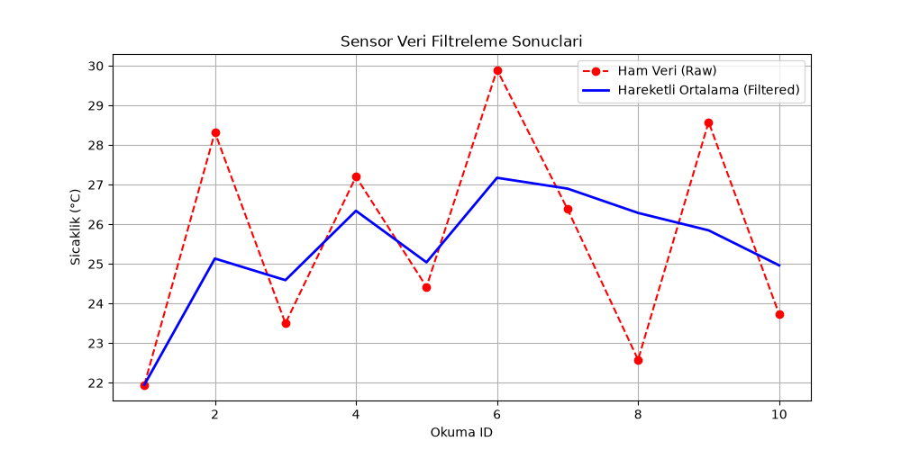

# Sensor Data Logger & Moving Average Filter

A lightweight embedded-style sensor simulation, filtering, and telemetry analysis project written in C++ and Python.

## Architecture
- **C++ Engine (`src/main.cpp`)**: Simulates noisy analog sensor readings and applies a rolling moving-average filter (window size = 3) in real-time.
- **Telemetry Storage (`data/sensor_data.csv`)**: Logs timestamped/indexed raw and filtered measurement pairs into structured CSV format.
- **Visualization Tool (`plot_data.py`)**: Parses the generated dataset and visualizes the noise reduction performance via Matplotlib.

## Output Results


## How to Run

### 1. Build and Run C++ Engine
```powershell
g++ src/main.cpp -o sensor_logger
./sensor_logger
```

### 2. Visualize Telemetry
```powershell
python plot_data.py
```